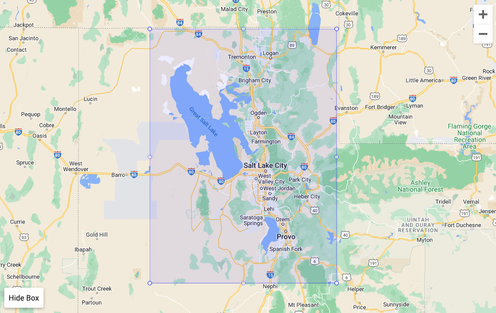

# PurpleAir
## Files:
- `purple-air-api-tutorial.ipynb`
    - Attempt at tutorial [here](https://community.purpleair.com/t/making-api-calls-with-the-purpleair-api/180), but attempt to add sensors to group hung for several minutes and never processed
- `purple-air-latlongpull.ipynb`
    - When failures reaches above, attempt at pulling SLC sensors without a group, using long/lat from code [here](https://community.purpleair.com/t/aqi-location-bound-list-of-sensors-limited/3343)
    - Below is the area around SLC used for lat/long, indicated by the box

- `purple-air-eda.ipynb`
    - EDA of all SLC sensors, findings in the EDA Findings below
    - Cells are commented out that leverage the API and instead this notebook reads in `slc_sensor_data_20240130.csv` data, to avoid using up API transactions
- `slc_sensor_data_20240130.csv`
    - Contains all data for all (indoor and outdoor) SLC sensors
    - Created using API
    - USE THIS to pull data for exploration to avoid using API and accruing costs
- `sample_sensor_data_114443.txt`
    - Example output from all fields for one sensor for exploration
    - More information on fields can be found [here](https://api.purpleair.com/#api-sensors-get-sensors-data)
- `purple-air-variables.json`
    - Work in progress to store data as variables
    - Current variables:
        - `slc_sensor_list`
            - List of the total 616 sensor_ids in SLC as determined by map area above
        - `sensor_test`
            - List of 5 sensors from above for testing to lower run time and reduce cost of transaction
## Notes
- API calls cost points. Each newly created Organization starts out with 1,000,000 points, which must be assigned to individual projects.
    - Costs:
        - READ data from 1 sensor: 135 points for ALL fields
        - WRITE create group: 1 point
            - NOTE: If run multiple times, multiple groups will be created with the same name but different IDs
        - READ get group information: 10 points
            - Jot down ID immediately after group creation to avoid using points here
    - Pricing
        - Base is $1 = 100,000 points, but more points can be acquired per $1 based on the purchase amount (e.g., if you purchase $100 worth of points, $1 = 150,000 points)
- To query multiple sensors at once, we can create groups and assign it a name. Groups are given unique IDs and assigned to the API keys that they are created with. However, each sensor would need to be added individually and then queried. Instead, using lat/long does the trick without extra steps.
## Maximizing Points for AI4AQ
- TO DO: Create documentation for streamlined API call to minimize points used for one person to pull data we need
## EDA Findings
- Using the lat/long in `purple-air-eda.ipynb`, in the surrounding SLC area, there are:
    - 159 indoor sensors
    - 457 outdoor sensors
- The code is formatted really nicely - may just need to convert UNIX datetime if we feel any need for it to be readable, but usable as UNIX
- Entire dataset of 616 sensors:
    - Columns that could be used as unique identifiers for each sensor:
        - `sensor_index`
        - `date_created`
        - `primary_id_a`
        - `primary_key_a`
        - `primary_id_b`
        - `primary_key_b`
        - `secondary_id_a`
        - `secondary_key_a`
        - `secondary_id_b`
        - `secondary_key_b`
    - All 616 are public
        - Private are likely not accessible to us, requires different API call
    - `name` likely not helpful without further information
    - 5 different `model` types, name and counts below
        - PA-II         368
        - PA-I          114
        - PA-II-SD       74
        - PA-II-FLEX     45
        - PA-I-LED       13
        - UNKNOWN         2
    - `position_rating` is a 'star' rating of position accuracy. 0 stars is nowhere near the claimed location whereas 5 stars is close to the map location as indicated by the latitude and longitude values.
        - 528 of the sensors have a 5 rating, 62 have 0.
        - Maybe we filter down to just 5s?
    - All particulate matter fields seem to have values, but would be good to look into outliers more
    - `stats` column is a dictionary of different pm2.5 datapoints, such as 10-minute average and 24-hour average, for each sensor, across channel A (`stats_a`) and channel B (`stats_b`).
        - Only pm2.5, but may be worth extracting into own columns?
    - There are different `confidence` scores - not sure what they means, however, over half (~370) tend to have a value of 100